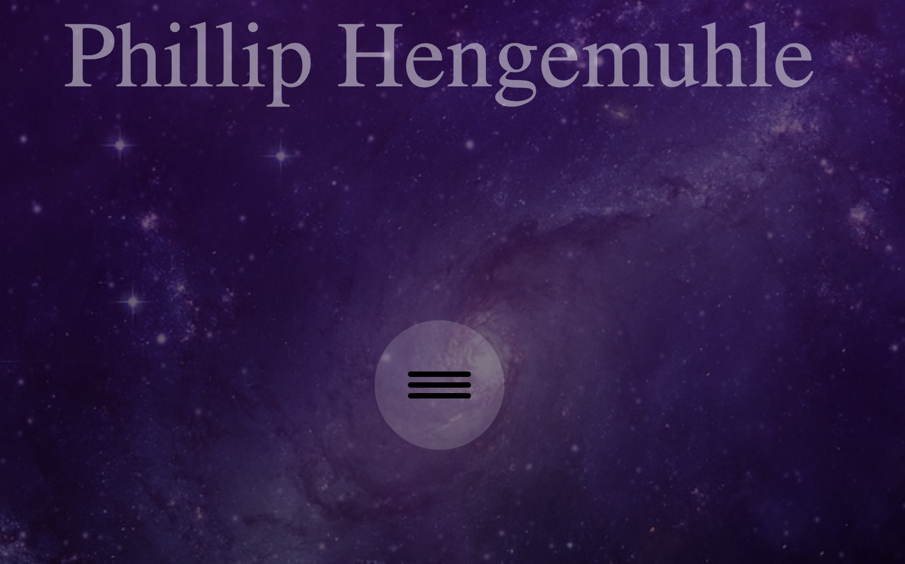

#** Phillip Hengemuhle portfolio site take 1 **

##

### Wireframe 
[Beginning wireframe build for this project](.img/wireframe.jpg)

### ScreenShot
[Screen Shot of the front page](./img/Screen Shot 2018-09-05 at 1.00.31 PM.png)

### Website link
[Deployed site](http://large-net.surge.sh/)

# Phillip Hengemuhle Portfolio

This portfolio was built to demonstrate my personal knowledge of html and css. Also a way to display projects created throughout my experience at Galvanize. 

## Deployment

This was deployed using firebase.

## Built With

* [Java Script](https://developer.mozilla.org/en-US/docs/Web/JavaScript) - Primary language

* [HTML 5](https://developer.mozilla.org/en-US/docs/Web/Guide/HTML/HTML5) - Markdown language

* [Css](https://developer.mozilla.org/en-US/docs/Web/CSS)- Style

* [Firebase](https://firebase.google.com/docs/)- Deployment

## Authors

* **Phillip Hengemuhle**

## Deployed Links
[Phillip Hengemuhle Portfolio](phengemuhle.com)
